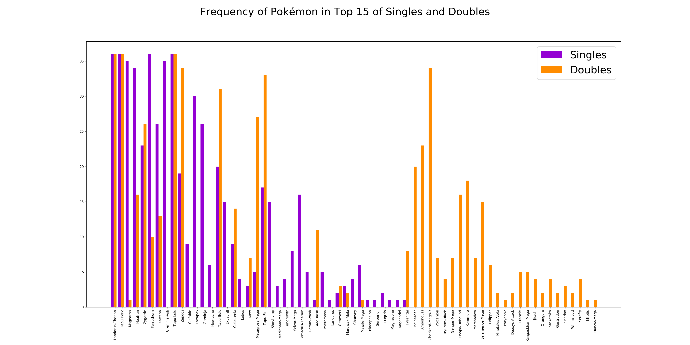

# What? Metagame is evolving!

# Table of Contents
1. [Overview](#overview)
2. [Questions](#questions)
3. [Cleaning](#cleaning)
4. [Data Analysis](#data-analysis)
5. [Conclusion](#conclusion)

## Overview
Pokémon is a wordlwide phenomenon. Pokémon Red and Green were released in 1996 in Japan, and since then it has gone on to become the [highest grossing media franchise on the planet](https://en.wikipedia.org/wiki/List_of_highest-grossing_media_franchises), grossing an estimated $94 billion USD. There's games, movies, cards, and more merchandise than I should realistically own. The core of this behemoth, the games, are produced every few years and are separated into generations where each generation has slightly different mechanics Pokémon. They are about you collecting fun and unique monsters, all while battling rivals and villains on your quest to be the very best, like no one ever was.

Despite its kid friendly veneer, Pokémon has quite a lot of depth to it. For a quick rundown each Pokémon has:
- 1 or 2 of 18 types, interacting through weaknesses, resistances, and immunities
- 6 stats: HP, Attack, Defense, Special Attack, Special Defense, and Speed
- Base stats determening the growth rate and maximum value for each stat, unique to each species
- IVs, increasing each stat by up to 31, unique to each individual
- EVs, increasing each stat by up to 64, which are gained from defeating other Pokémon
- A movepool, the set of moves they have access to, of which they can only have 4 at a time

Conisdering that, it should come as no surprise that a competitive community has popped up around these games. The official, unofficial competitive community is Smogon.

Battles are conducted using their simulator, Pokémon Showdown. There are an absurd number of metagames you can play, all broken up into tiers and formats. The tier I will be focusing on is OU, short for overused and the standard tier that sees the most play, while the formats I will be looking at are singles and doubles. In both, each player brings 6 Pokémon to the battle, with only one Pokémon per side in singles and two in doubles. I will also be focusing on the 3 years of the previous generation's metagame, generation 7, as the newer generation is out so will most likely be relatively static from here on out.

The dataset was pulled from Smogon's usage [stats](https://www.smogon.com/stats/), which have been updated monthly since November 2014, using [this code](src/get_data.py).

## Questions
- What was the variety of the two formats during generation 7's metagame like?
- How do the two formats compare to each other over that metagame's lifetime?

## Cleaning
Even though I was using a text file of a table, cleaning the data was relatively straightforward. There weren't any null values, though the formatting on the column titles was a bit wonky, and I had to figure out how to remove the borders that had been put in by whoever had posted the file. The column names, in addition to being weirdly formatted, were not the best named, with two of them just being named %. After cleaning the data I had 3 years of monthly usage data, with each Pokémon in the meta, their rank, weighted usage percentage, raw numbers, raw percentage, real numbers, and real percentage.

The real numbers were how many times that Pokémon was actually sent out onto the field, but since this data was not collected for the doubles format I removed it. The raw numbers are how many total times players had that Pokémon on their team. The in depth explanation for how the data was weighted can be found [here](https://www.smogon.com/forums/threads/weighted-stats-faq.3478570/). The short version is that players with a higher rank have their team choices weighted more than lower ranked ones, so as to minimize the impact troll teams and people who are onyl playing their favorites. The code used to clean the dat is [here](src/clean_data.py).

## Data Analysis
The way I decided to look at the general variety of the metagame was to look at how often each Pokémon got into the top 15 of usage each month with [this](frequency_plot.py) code.

As you can see, a majority of Pokémon are decently good at both singles and doubles, Landorus-Therian, Tapu Koko, and Tapu Lele all being in the top 15 most used mons for the entirety of the metagame. Considering the utility all of these Pokémon bring to the table I'm not all that surprised. What did initially surprise me is that Aegislash was ranked first in the singles format the very first month of the metagame, and then never placed again. After some research the reason is because it was banned from the OU tier for being too over-centralizing.

It does seem that poor in one format does not preclude a mon from being good in the other, with many Pokémon having no usage in the top 15 in one format. This comes down to the natures of the formats, with doubles being very fast paced, with too much damage output for dedicated walls to do well, and support Pokémon really having a chance to shine. Singles on the otherhand is slower, with more of a focus on setting up and outmaneuvering your opponent. There is a belief in the community that, due to their natures, doubles is a more varied format, with a wider variety of viable Pokémon. To test that I looked at the number of Pokémon with a weighted usage greater than or equal to 1% per month using [this](src/variety_plot) code.

Just looking at these two graphs it looks pretty obvious that there is much more variety in the double format, though to be more rigorous I used [this](src/stat_test.py) code to perform a t-test on the two distributions, getting me a p-score of about 1.9 X 10^-13. Going into this I had expected the total variety to slowly decrease as the meta settled, which is what you see in the doubles format, but not in singles. Singles seems to remain pretty constant throughout the 3 years which I can't really explain.

## Conclusion
Variety in any competitve game is a crucial component. Without it, the game becomes stale and people stop playing. Pokémon has a fair amount of variety, with about 100 mons in singles and over a hundred mons in doubles having at least mrginal use. But there is still clearly room for imporvement, with 3 Pokémon never dropping below 15 in usage rank for the 3 years of this meta. The uselful thing about the data is the weighted usage allows us to get a look at what Pokémon skilled players use on their teams, giving us a better understanding of the metagame as a whole.
